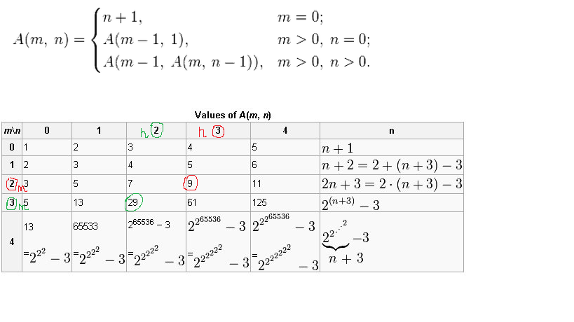

[Задача 64](https://github.com/allseenn/cSharp/blob/main/09.Tasks/64/Program.cs) Задайте значение N. Напишите программу, которая выведет все натуральные числа в промежутке от N до 1.
```
N = 5 -> "5, 4, 3, 2, 1"
N = 8 -> "8, 7, 6, 5, 4, 3, 2, 1"
```
[Задача 66](https://github.com/allseenn/cSharp/blob/main/09.Tasks/66/Program.cs) Задайте значения M и N. Напишите программу, которая найдёт сумму натуральных элементов в промежутке от M до N.
```
M = 1; N = 15 -> 120
M = 4; N = 8. -> 30
```
[Задача 68](https://github.com/allseenn/cSharp/blob/main/09.Tasks/68/Program.cs) Напишите программу вычисления функции Аккермана с помощью рекурсии. Даны два неотрицательных числа m и n.
```
m = 2, n = 3 -> A(m,n) = 29
```


### Дополнительные задания (необязательные)
[Задача 57](https://github.com/allseenn/cSharp/blob/main/08.Tasks/57/Program.cs) Составить частотный словарь элементов двумерного массива. Частотный словарь содержит информацию о том, сколько раз встречается элемент входных данных.
```
1, 2, 3
4, 6, 1
2, 1, 6

1 встречается 3 раза
2 встречается 2 раз
3 встречается 1 раз
4 встречается 1 раз
6 встречается 2 раза
```
[Задача 59](https://github.com/allseenn/cSharp/blob/main/08.Tasks/59/Program.cs) Задайте двумерный массив из целых чисел. Напишите программу, которая удалит строку и столбец, на пересечении которых расположен наименьший элемент массива.
Например, задан массив:
```
1 4 7 2
5 9 2 3
8 4 2 4
5 2 6 7
```
Наименьший элемент - 1, на выходе получим
следующий массив:
```
9 4 2
2 2 6
3 4 7
```
[Задача 61](https://github.com/allseenn/cSharp/blob/main/08.Tasks/61/Program.cs) Вывести первые N строк треугольника Паскаля. Сделать вывод в виде равнобедренного треугольника